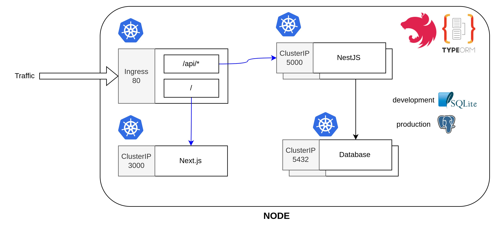

# Parking Lot V3

## Docker

### Production Run

Start container in background mode  
`docker-compose up --build -d`

Stop with clean up resources  
`docker-compose down -v`

### Production Migrtion

`docker exec -it parking-lot-api printenv`

### Run the db migraiton

`docker exec -it parking-lot-api npm run migration:run`

## Kubernetes
