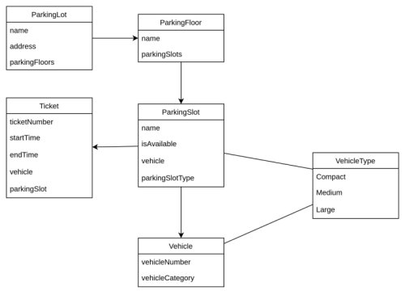

nest create parking-lot-v3  
npm install --save @nestjs/typeorm typeorm sqlite3

nest g module parking-lots  
nest g controller parking-lots  
nest g service parking-lots

nest g module parking-floors  
nest g controller parking-floors  
nest g service parking-floors

nest g module parking-slots  
nest g controller parking-slots  
nest g service parking-slots

nest g module vehicle-type  
nest g controller vehicle-type  
nest g service vehicle-type

# Migration

Create schema migration
`npm run migration:generate -- db/migrations/Init`  
`npm run migration:run` - Run the migration

Create an empty migration, for master data purpose  
`npm run migration:create db/migrations/MasterData`

# Class-Validator & Class-Transformer

`npm install class-validator class-transformer`
